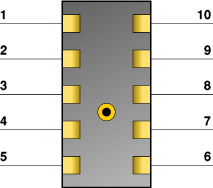

MX Connector
------------

View (note vertically offset center keying peg location):

* Female receptacle viewed from mating face
* Male plug solder cups viewed from assembly face

Pinout map:

* Hirose Pin 2 (GRN) - MX Pin 8 (DATA)
* Hirose Pin 3 (YEL) - MX Pin 10 (SENSE)
* Hirose Pin 4 (BLK) - MX Pin 9 (GND)

Hirose pins 1, 5, and 6 should NOT be connected to anything (leave floating)

Do not attach both the MX connector to a keyloader and the Hirose connector to the KFDtool at the same time. It will not damage anything, however, keyload operations may fail.
