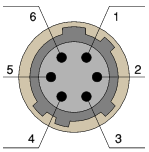
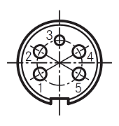

6 Pin Hirose Connector
----------------------

View:

* Female receptacle/jack viewed from mating face
* Male plug solder cups viewed from assembly face

Pinout map / wire color map:

* 1 - RED (N/C)
* 2 - GRN (DATA)
* 3 - YEL (SENSE)
* 4 - BLK (GND)
* 5 - WHT (N/C)
* 6 - BLU (N/C)

6 Pin Male Plug Hirose P/N: HR10A-7P-6P(73)

6 Pin Female Jack Hirose P/N: HR10A-7J-6S(73)

Hirose Cable Retention Crimp Tool P/N: HR10A-TC-02

5 Pin Amp Connector
-------------------

View:

* Female receptacle/jack viewed from mating face
* Male plug solder cups viewed from assembly face

5 Pin Male Plug Amp (silver plated) P/N: T3360001U

5 Pin Male Plug Amp (gold plated) P/N: T3360018U

AC100
-----

* 6 pin male plug Hirose to 6 pin male plug Hirose cable
* Wired straight through (pin 1 to pin 1, pin 2 to pin 2, etc)
* Pins 1, 5, and 6 are electrically connected in the cable assembly, however are not connected inside the KFDtool adapter

AC101
-----

* 6 pin male plug Hirose pigtail
* Pins 1, 5, and 6 are electrically connected in the cable assembly, however are not connected inside the KFDtool adapter

AC102
-----

* 6 pin female jack Hirose pigtail
* Pins 1, 5, and 6 are electrically connected in the cable assembly, however are not connected inside the KFDtool adapter

AC103
-----

* 6 pin female jack Hirose to 5 pin male plug Amp

Pinout:

* Amp Pin 1 - Hirose Pin 5
* Amp Pin 2 - Hirose Pin 1
* Amp Pin 3 - Hirose Pin 2
* Amp Pin 4 - Hirose Pin 4
* Amp Pin 5 - Hirose Pin 4
